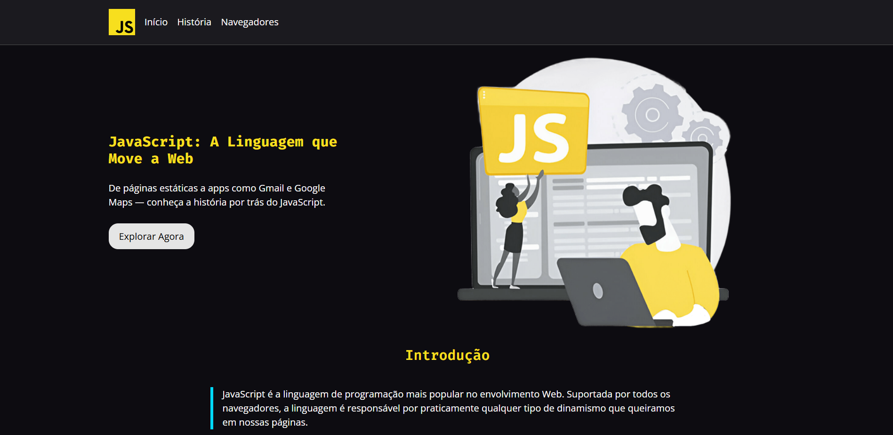

# 📚 Breve Histórico do JavaScript

Este projeto é uma landing page que apresenta um breve histórico sobre a linguagem de programação **JavaScript**.

O site foi construído utilizando **HTML** e **CSS** para a estrutura e o design.

---

# 📌 Objetivo do Projeto

Este site foi desenvolvido na **primeira aula de JavaScript** a pedido do professor **Zárak Barreto** em uma prazo de 1h-2h.

O objetivo foi **testar nossas habilidades de HTML e CSS**, aplicando conceitos fundamentais de estruturação de páginas, semântica e estilização.

Embora o foco fosse HTML e CSS, o tema sobre JavaScript foi escolhido para servir de introdução ao universo de desenvolvimento web dinâmico, preparando o terreno para os próximos aprendizados.

---

## 🚀 Sobre o Projeto

O site apresenta um resumo da história do **JavaScript**, explorando:
- 📖 **Introdução**: importância e papel do JavaScript no desenvolvimento web.  
- 🕰️ **História**: origem da linguagem e sua evolução desde o *Livescript*.  
- 🌐 **Navegadores**: o impacto da "Guerra dos Navegadores" e surgimento de bibliotecas de compatibilidade.  

---

## 🛠️ Tecnologias Utilizadas
- **HTML5** → Estrutura e semântica do site  
- **CSS3** → Estilização e responsividade  

---

## 👩‍💻 Equipe de Desenvolvimento
- Cauany Rodrigues  
- Bruna Xavier  
- Jefferson Thiago  
- Luiz Filipe  

---

## 📷 Prévia do Projeto

---

## 📄 Licença
Este projeto foi desenvolvido apenas para fins **educacionais** e não possui fins comerciais.
